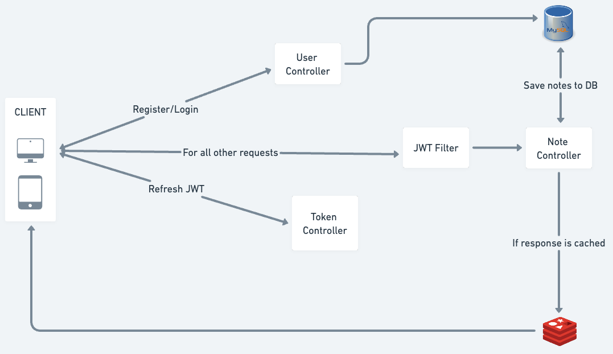

# NoteWorthy

NoteWorthy is a productive application inspired from Google Keeps. It lets you store your notes in the form of title, description as well as images.

## About

NoteWorthy is a full-stack application with its backend built in Java with Spring Boot and the frontend is native Android app made in Kotlin

## App Features

- **NOTES** - You can save all your frequently visited notes and access it from anywhere in the world.
- **IMAGES** - You can also save multiple images, view them in the app and download them if required later in time.
- **PRIORITY** - Assign priority(LOW, MEDIUM, HIGH) to your notes and sort them accordingly.
- **SEARCH** - Lost in your own notes? No problem! You can search your notes with the word you remember. Be it the title or description.

## Built With
* [Coroutines](https://developer.android.com/kotlin/coroutines) - Coroutines are used to perform two or more tasks parallely or asynchronously. They are very useful when you need to load data from remote web services into your app.
* [Retrofit](https://square.github.io/retrofit/) - Retrofit is a powerful library for creating HTTP-based API clients in Android applications. It simplifies the process of making network requests, handling responses, and parsing JSON data. Retrofit is widely used to integrate RESTful APIs into Android apps, providing a clean and efficient way to communicate with backend servers.
* [Dagger Hilt](https://developer.android.com/training/dependency-injection/hilt-android) - Dagger Hilt is a library that provides an abstraction over Dagger. We will use this library to implement Dependency Injection in our app.
* [Lottie](https://lottiefiles.com/) - Lottie is another popular library developed by Airbnb. It makes it extremely easy to import and play .json format animations in our app.
* [Glide](https://github.com/bumptech/glide) - Glide is an image loading library. It makes it really easy to load images from cloud into our app. Moreover, we can also set placeholder and error images and also change the quality of images.
* [Architectural Components](https://developer.android.com/topic/architecture) - To use Viewmodel in our app, we will use this library.
* [Navigation Component](https://developer.android.com/guide/navigation/navigation-getting-started) - This is the Android's library that makes it really easy to navigate from one fragment to another.
* [Google Material Design](https://material.io/develop/android) - This library provides a huge collection of ready to use beautiful UI components that are much better than Android's default UI components.

## Project Architecture:
This app is built using [Model View ViewModel Architecture](https://developer.android.com/jetpack/docs/guide#recommended-app-arch)(MVVM).

## 📸 Screenshots 

|   |   |   |
|---|---|---|
||  | 
| |  | 
|| | 
|

## High-level Design [Backend]

## Contact

For any queries, you can mail me at yashmahjan0521@gmail.com

